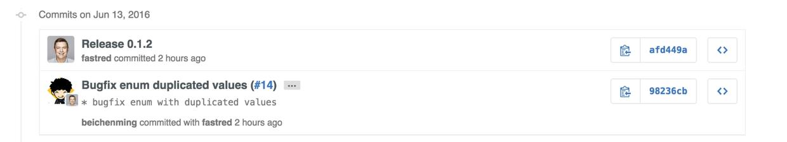

`原创文章转载请注明出处，谢谢`

###### 最近在项目中遇到一个问题，我们的业务逻辑中存在4种Purpose Type，每种Purpose Type又有5种Status type，所以就有20种组合，每种组合出来的type都会对应一个string，而且未来type的数量可能会越来越多，所以这个如果用switch，if等来操作判断对应的字符串显然是不合理的，太冗余不利于扩展，采用数据字典的方式也不太好还需要自己手动建，每次更新也要手动修改，最好的方式是我们可以直接通过两个type就组合出对应的string，但是OC中反射只是针对于Class，对于基础类型的操作我们只能依赖于C++来帮我们完成。

`如下有这两个enum，可以组合成20种type的string`

```
typedef NS_ENUM(NSUInteger, BMTAccountType) {
  kBMTAccountTypeUnknow = 0,
  kBMTAccountTypeConception = 1,
  kBMTAccountTypeContraception = 2,
  kBMTAccountTypeMenstruation = 4,
  kBMTAccountTypePregnancyMonitor = 8,
};


typedef NS_ENUM(NSInteger, BMTMenstruationPeriodStatusType) {
  kReportCalendarDayTypeUnknown = -1,
  kReportCalendarDayTypeNormal,    
  kReportCalendarDayTypeMenustration,
  kReportCalendarDayTypeOvulation,
  kReportCalendarDayTypeCalculateMenstruation,
  kReportCalendarDayTypeOvulationDays
};

```
`我们的目标是可以自动组合成以下的方式直接调用（命名不是很优雅）。`

```
Hint.kBMTAccountTypeConception.kReportCalendarDayTypeNormal.Title = "XXX";
Hint.kBMTAccountTypeConception.kReportCalendarDayTypeOvulation.Title = "XXX";
Hint.kBMTAccountTypeConception.kReportCalendarDayTypeMenustration.Title = "XXX";
Hint.kBMTAccountTypeConception.kReportCalendarDayTypeOvulationDays.Title = "XXX";

Hint.kBMTAccountTypeContraception.kReportCalendarDayTypeNormal.Title = "XXX";
Hint.kBMTAccountTypeContraception.kReportCalendarDayTypeOvulation.Title = "XXX";
Hint.kBMTAccountTypeContraception.kReportCalendarDayTypeMenustration.Title = "XXX";
Hint.kBMTAccountTypeContraception.kReportCalendarDayTypeOvulationDays.Title = "XXX";

Hint.kBMTAccountTypeMenstruation.kReportCalendarDayTypeNormal.Title = "XXX";
Hint.kBMTAccountTypeMenstruation.kReportCalendarDayTypeOvulation.Title = "XXX";
Hint.kBMTAccountTypeMenstruation.kReportCalendarDayTypeMenustration.Title = "XXX";
Hint.kBMTAccountTypeMenstruation.kReportCalendarDayTypeOvulationDays.Title = "XXX";

Hint.kBMTAccountTypePregnancyMonitor.kReportCalendarDayTypeNormal.Title = "XXX";
Hint.kBMTAccountTypePregnancyMonitor.kReportCalendarDayTypeOvulation.Title = "XXX";
Hint.kBMTAccountTypePregnancyMonitor.kReportCalendarDayTypeMenustration.Title = "XXX";
Hint.kBMTAccountTypePregnancyMonitor.kReportCalendarDayTypeOvulationDays.Title = "XXX";
```
`我们的基本思路是自定义NS_ENUM，然后使用__VA_ARGS__进行字符串解析，去除空格和等号，最后反射出结果,如下：`

```
#ifndef BMT_REFLECT_ENUM_H
#define BMT_REFLECT_ENUM_H

NSString *reflectString(NSString *enumDefinition, NSNumber *number);

__attribute__((overloadable)) NSString *BMTReflectStringForMember(NSInteger value);

#define BMT_REFLECTABLE_ENUM(type, name, ...) \
typedef NS_ENUM(type, name) { \
__VA_ARGS__ \
}; \
\
__attribute__((overloadable)) static inline NSString *BMTReflectStringForMember(name value) { \
  return reflectString(@(#__VA_ARGS__), @(value)); \
} \


#endif

```

```
- (NSArray *)makeArray:(id(^)(id obj))block {
  NSMutableArray *array = [NSMutableArray arrayWithCapacity:[self count]];
  for(id obj in self) {
    [array addObject:block(obj)];
  }
  return array;
}

- (void)setupWithEnumDefinition:(NSString *)enumDefinition {
  NSNumberFormatter *numberFormatter = [NSNumberFormatter new];
  numberFormatter.numberStyle = NSNumberFormatterDecimalStyle;
  
  NSInteger currentIndex = -1;
  NSMutableDictionary *mutableDictionary = [NSMutableDictionary new];
  
  for (NSString *member in [enumDefinition componentsSeparatedByString:@","]) {
    NSArray *parts = [[member componentsSeparatedByString:@"="] makeArray:^NSString *(NSString *element) {
      return [element stringByTrimmingCharactersInSet:[NSCharacterSet whitespaceAndNewlineCharacterSet]];
    }];
    
    NSAssert(parts.count == 1 || parts.count == 2, @"Reflect Enum illegal member definition");
    
    NSString *name = [parts firstObject];
    if (parts.count == 2) {
      NSString *valueString = [parts lastObject];
      NSNumber *number = [numberFormatter numberFromString:valueString];
      
      if (!number) {
        NSAssert(NO, @"Reflect Enum get string for the enum with duplicated values");
      } else {
        NSString *matchingObject = [mutableDictionary objectForKey:number];
        if (matchingObject) {
          NSAssert(NO, @"Reflect Enum get string for the enum with duplicated values");
        }
      }
      
      currentIndex = [number longLongValue];
    } else {
      currentIndex++;
    }
    mutableDictionary[@(currentIndex)] = name;
  }
  
  _mapFromValueToString = [mutableDictionary copy];
}
```

`这里有几个需要注意点：`

`* 我们需要缓存每个枚举解析后的值，防止浪费资源`

`* 我们的反射枚举类型中不能包括相同的枚举值，key-value是唯一对应的`

```
// Demo one
REFLECTABLE_ENUM(NSInteger,
   ThirdEnum,
   ThirdEnum1 = 0,
   ThirdEnum2 = ThirdEnum1,
   ThirdEnum3,
   ThirdEnum4
);

// Demo two
REFLECTABLE_ENUM(NSInteger,
   ThirdEnum,
   ThirdEnum1 = 0,
   ThirdEnum2 = 0,
   ThirdEnum3,
   ThirdEnum4
);
```

###### github上有一个项目就是做了[这件事](https://github.com/fastred/ReflectableEnum)，不过由于这个功能比较简单，所以我们没有必要去依赖这个库，自己写反而比较方便，而且这个项目有一个小bug。就是上面的例子，为了保持key-value的唯一对应，我们需要处理上面的两种情况，但是项目里仅处理了第一种情况，但第二种情况其实也是需要处理的。

#### 我提交的代码通过审核BugFix了。



