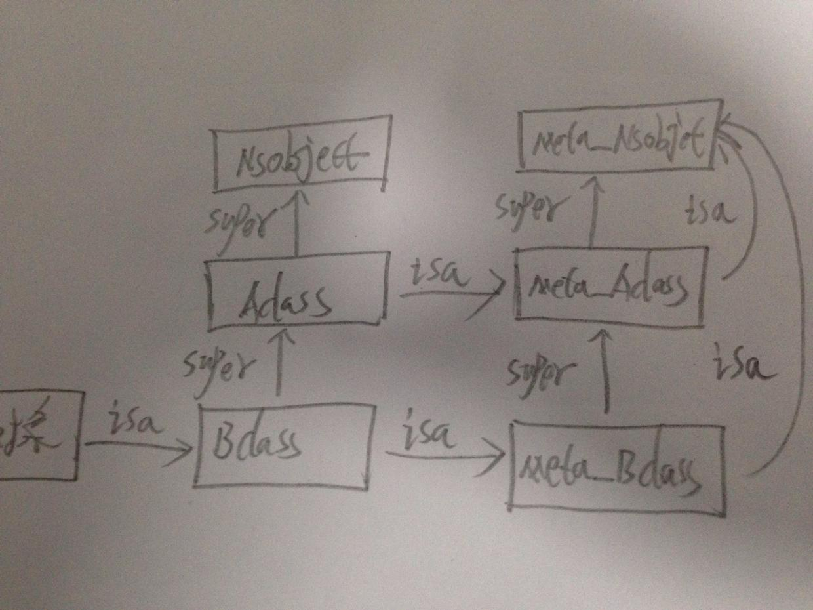
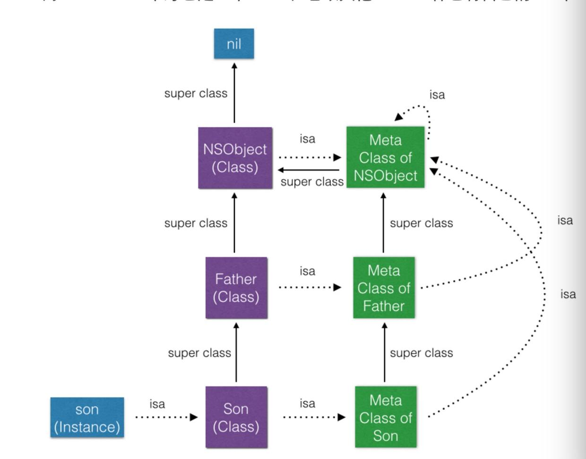
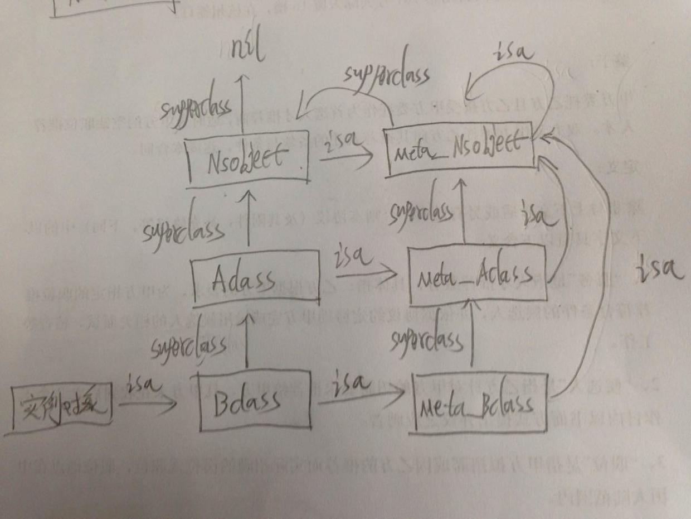

`原创文章转载请注明出处，谢谢`
###### 很早就想讲关于NSObject这个对象的模型，其实网上有不少讲这方面知识的，但是我感觉很多都是千遍一律，而且有一些结论的并没有系统的论证，所以我会从我的理解层面来解析只要分为两方面，第一篇主要介绍NSObject整体的模型结构，第二篇是解析NSObject的一些方法。可能这两篇分享会很长，这个也是为了详细的介绍这些知识。

```
typedef struct objc_class *Class;
typedef struct objc_object *id;

@interface NSObject <NSObject> {
    Class isa  OBJC_ISA_AVAILABILITY;
}

struct objc_object {
    Class isa  OBJC_ISA_AVAILABILITY;
};

```
NSObject实现了一个NSObject的协议，里面包含一个isa的指针，指向一个objc_class的结构体；而id其实就是objc_object的结构指针，所以它可以指向任何对象。

那么objc_class是一个什么结构呢？

```
struct objc_class {
    Class isa  OBJC_ISA_AVAILABILITY;

#if !__OBJC2__
    Class super_class                                        OBJC2_UNAVAILABLE;
    const char *name                                         OBJC2_UNAVAILABLE;
    long version                                             OBJC2_UNAVAILABLE;
    long info                                                OBJC2_UNAVAILABLE;
    long instance_size                                       OBJC2_UNAVAILABLE;
    struct objc_ivar_list *ivars                             OBJC2_UNAVAILABLE;
    struct objc_method_list **methodLists                    OBJC2_UNAVAILABLE;
    struct objc_cache *cache                                 OBJC2_UNAVAILABLE;
    struct objc_protocol_list *protocols                     OBJC2_UNAVAILABLE;
#endif

} OBJC2_UNAVAILABLE;
```
`这个结构大家肯定不会陌生，这里重要的点主要包括两方面的问题：`

 * isa和super_class的区别,也就是class和metaclass的区别（这个后面要重点详细讲）
 * objc_ivar_list, objc_method_list, objc_cache, objc_protocol_list几个struct的具体的结构问题
 
接下来就是我们的正题了，到底一个对象编译后变成什么样了呢？

首先我们定义如下的两个Class：

```
// AClass.h
@protocol AClassProtocol <NSObject>

- (void)protocolsMethod_AClass;

@end

@interface AClass : NSObject<AClassProtocol>

@property (nonatomic) NSString *name_AClass;

- (void)instanceMethods_AClass;

+ (void)classMethods_AClass;

@end

// AClass.m
@interface AClass() {
    NSString *_address;
}

@end

@implementation AClass

- (void)instanceMethods_AClass {
    
}

- (void)protocolsMethod_AClass {
    
}

+ (void)classMethods_AClass {
    
}

@end


// BClass.h
@interface BClass : AClass

@property (nonatomic) NSString *name_BClass;

- (void)instanceMethods_BClass;

+ (void)classMethods_BClass;

@end

// BClass.m
@implementation BClass
- (void)instanceMethods_BClass {
    
}

+ (void)classMethods_BClass {
    
}

@end

```
接下来我们把它们编译成C++文件，我们以AClass.cpp为例，来分析一下文件的组成结构：

```
struct _class_ro_t {
	unsigned int flags;
	unsigned int instanceStart;
	unsigned int instanceSize;
	unsigned int reserved;
	const unsigned char *ivarLayout;
	const char *name;
	const struct _method_list_t *baseMethods;
	const struct _objc_protocol_list *baseProtocols;
	const struct _ivar_list_t *ivars;
	const unsigned char *weakIvarLayout;
	const struct _prop_list_t *properties;
};

struct _class_t {
	struct _class_t *isa;
	struct _class_t *superclass;
	void *cache;
	void *vtable;
	struct _class_ro_t *ro;
};

```
编译以后的结构和我们之前定义的objc_class稍微有点区别，但是大致的结构还是一样的，_class_ro_t中定义了我们之前所说的几个struct结构。

```
static struct _class_ro_t _OBJC_CLASS_RO_$_AClass __attribute__ ((used, section ("__DATA,__objc_const"))) = {
	0, __OFFSETOFIVAR__(struct AClass, _name), sizeof(struct AClass_IMPL), 
	(unsigned int)0, 
	0, 
	"AClass",
	(const struct _method_list_t *)&_OBJC_$_INSTANCE_METHODS_AClass,
	(const struct _objc_protocol_list *)&_OBJC_CLASS_PROTOCOLS_$_AClass,
	(const struct _ivar_list_t *)&_OBJC_$_INSTANCE_VARIABLES_AClass,
	0, 
	(const struct _prop_list_t *)&_OBJC_$_PROP_LIST_AClass,
};

extern "C" __declspec(dllexport) struct _class_t OBJC_CLASS_$_AClass __attribute__ ((used, section ("__DATA,__objc_data"))) = {
	0, // &OBJC_METACLASS_$_AClass,
	0, // &OBJC_CLASS_$_NSObject,
	0, // (void *)&_objc_empty_cache,
	0, // unused, was (void *)&_objc_empty_vtable,
	&_OBJC_CLASS_RO_$_AClass,
};
```
我们的AClass被定义成一个叫做OBJC_CLASS_$AClass的struct对象，这里的metaclass和class等等目前都是0，先不要急后面会赋值的，这里重点先介绍_OBJC_CLASS_RO_$AClass的结构，它就是一个_class_ro_t的结构体，我们发现_method_list_t，_objc_protocol_list，_ivar_list_t，_prop_list_t分别被初始化了值，那么我们就来看一下它们对应的结构：

```
// _OBJC_$_INSTANCE_METHODS_AClass
struct _objc_method {
	struct objc_selector * _cmd;
	const char *method_type;
	void  *_imp;
};
static struct /*_method_list_t*/ {
	unsigned int entsize;  // sizeof(struct _objc_method)
	unsigned int method_count;
	struct _objc_method method_list[4];
} _OBJC_$_INSTANCE_METHODS_AClass __attribute__ ((used, section ("__DATA,__objc_const"))) = {
	sizeof(_objc_method),
	4,
	{{(struct objc_selector *)"instanceMethods_AClass", "v16@0:8", (void *)_I_AClass_instanceMethods_AClass},
	{(struct objc_selector *)"protocolsMethod_AClass", "v16@0:8", (void *)_I_AClass_protocolsMethod_AClass},
	{(struct objc_selector *)"name", "@16@0:8", (void *)_I_AClass_name},
	{(struct objc_selector *)"setName:", "v24@0:8@16", (void *)_I_AClass_setName_}}
};

```
`_OBJC_$__INSTANCE_METHODS_AClass是一个实例方法的列表，其中也包括了get/set方法，以及声明了protocol的方法。而_objc_method的结构其实就是一个objc_selector，加上类型type，还有就是一个imp的指针。（有没有发现少了一个类方法在里面，下面会介绍原因）`

```
// _OBJC_CLASS_PROTOCOLS_$_AClass
static struct /*_protocol_list_t*/ {
	long protocol_count;  // Note, this is 32/64 bit
	struct _protocol_t *super_protocols[1];
} _OBJC_CLASS_PROTOCOLS_$_AClass __attribute__ ((used, section ("__DATA,__objc_const"))) = {
	1,
	&_OBJC_PROTOCOL_AClassProtocol
};

static struct /*_method_list_t*/ {
	unsigned int entsize;  // sizeof(struct _objc_method)
	unsigned int method_count;
	struct _objc_method method_list[1];
} _OBJC_PROTOCOL_INSTANCE_METHODS_AClassProtocol __attribute__ ((used, section ("__DATA,__objc_const"))) = {
	sizeof(_objc_method),
	1,
	{{(struct objc_selector *)"protocolsMethod_AClass", "v16@0:8", 0}}
};

struct _protocol_t _OBJC_PROTOCOL_AClassProtocol __attribute__ ((used, section ("__DATA,__datacoal_nt,coalesced"))) = {
	0,
	"AClassProtocol",
	(const struct _protocol_list_t *)&_OBJC_PROTOCOL_REFS_AClassProtocol,
	(const struct method_list_t *)&_OBJC_PROTOCOL_INSTANCE_METHODS_AClassProtocol,
	0,
	0,
	0,
	0,
	sizeof(_protocol_t),
	0,
	(const char **)&_OBJC_PROTOCOL_METHOD_TYPES_AClassProtocol
};

static struct /*_protocol_list_t*/ {
	long protocol_count;  // Note, this is 32/64 bit
	struct _protocol_t *super_protocols[1];
} _OBJC_PROTOCOL_REFS_AClassProtocol __attribute__ ((used, section ("__DATA,__objc_const"))) = {
	1,
	&_OBJC_PROTOCOL_NSObject
};

```
`_OBJC_CLASS_PROTOCOLS_$AClass是一个比较复杂的结构体，因为篇幅的限制上面的代码我并没有给全，所有protocol的方法都会被添加到这个list里，但是其中还会包含NSObject protocol的那些方法，也就是_OBJC_PROTOCOL_NSObject中我没有给出来的那部分，因为比较复杂，我们之后分开单独讲。`

```
// _OBJC_$_INSTANCE_VARIABLES_AClass

struct _ivar_t {
	unsigned long int *offset;  // pointer to ivar offset location
	const char *name;
	const char *type;
	unsigned int alignment;
	unsigned int  size;
};

static struct /*_ivar_list_t*/ {
	unsigned int entsize;  // sizeof(struct _prop_t)
	unsigned int count;
	struct _ivar_t ivar_list[2];
} _OBJC_$_INSTANCE_VARIABLES_AClass __attribute__ ((used, section ("__DATA,__objc_const"))) = {
	sizeof(_ivar_t),
	2,
	{{(unsigned long int *)&OBJC_IVAR_$_AClass$_address, "_address", "@\"NSString\"", 3, 8},
	 {(unsigned long int *)&OBJC_IVAR_$_AClass$_name_AClass, "_name_AClass", "@\"NSString\"", 3, 8}}
};
```
`_OBJC_$INSTANCE_VARIABLES_AClass是一个指向实例变量的一个列表，这里我们会发现定义成属性的name也会变成一个实例变量，其实是因为编译器为你自动加上了@synthesize，所以变成了_name的一个实例变量，_ivar_t定义也是非常的简单。`

```
// _OBJC_$_PROP_LIST_AClass
struct _prop_t {
	const char *name;
	const char *attributes;
};

static struct /*_prop_list_t*/ {
	unsigned int entsize;  // sizeof(struct _prop_t)
	unsigned int count_of_properties;
	struct _prop_t prop_list[1];
} _OBJC_$_PROP_LIST_AClass __attribute__ ((used, section ("__DATA,__objc_const"))) = {
	sizeof(_prop_t),
	1,
	{{"name_AClass","T@\"NSString\",N,V_name_AClass"}}
};

```
`_OBJC_$PROP_LIST_AClass很明显就是属性的列表，即声明了@property的变量。`

`最后就是关于objc_cache的一些介绍，其实我们每次objc_msgsend一个方法的时候都是去遍历_method_list_t的，这样对于一些常用的方法就会导致效率不高，这个时候我们就会把常用的一些方法cache下来，通过key－value的map方式，讲name对应到各自的imp，这样就大大提高了效率。`

###### 好，讲到这里，我们已经解决了我们的其中一个问题，接下来就是要讲最重要的问题了，OC中的metaclass到底是个什么东西，了解过的同学应该都知道，isa指针指向的其实就是一个metaclass，metaclass其实是一个类对象的类，可能这样解释会很抽象，确实不容易理解，我们通过实际的代码结构来验证这个问题。

```
// AClass.cpp
static void OBJC_CLASS_SETUP_$_AClass(void ) {
	OBJC_METACLASS_$_AClass.isa = &OBJC_METACLASS_$_NSObject;
	OBJC_METACLASS_$_AClass.superclass = &OBJC_METACLASS_$_NSObject;
	OBJC_METACLASS_$_AClass.cache = &_objc_empty_cache;
	OBJC_CLASS_$_AClass.isa = &OBJC_METACLASS_$_AClass;
	OBJC_CLASS_$_AClass.superclass = &OBJC_CLASS_$_NSObject;
	OBJC_CLASS_$_AClass.cache = &_objc_empty_cache;
}

```
`以上就是我们之前在前面编译后的AClass对象，OBJC_CLASS_$AClass的isa指针是指向一个OBJC_METACLASS_$AClass，而superclass是指向OBJC_CLASS_$NSObject;那我们来看一下OBJC_METACLASS_$AClass的定义又是什么样的呢？`

```
extern "C" __declspec(dllexport) struct _class_t OBJC_METACLASS_$_AClass __attribute__ ((used, section ("__DATA,__objc_data"))) = {
	0, // &OBJC_METACLASS_$_NSObject,
	0, // &OBJC_METACLASS_$_NSObject,
	0, // (void *)&_objc_empty_cache,
	0, // unused, was (void *)&_objc_empty_vtable,
	&_OBJC_METACLASS_RO_$_AClass,
};

static struct _class_ro_t _OBJC_METACLASS_RO_$_AClass __attribute__ ((used, section ("__DATA,__objc_const"))) = {
	1, sizeof(struct _class_t), sizeof(struct _class_t), 
	(unsigned int)0, 
	0, 
	"AClass",
	(const struct _method_list_t *)&_OBJC_$_CLASS_METHODS_AClass,
	0, 
	0, 
	0, 
	0, 
};

static struct /*_method_list_t*/ {
	unsigned int entsize;  // sizeof(struct _objc_method)
	unsigned int method_count;
	struct _objc_method method_list[1];
} _OBJC_$_CLASS_METHODS_AClass __attribute__ ((used, section ("__DATA,__objc_const"))) = {
	sizeof(_objc_method),
	1,
	{{(struct objc_selector *)"classMethods_AClass", "v16@0:8", (void *)_C_AClass_classMethods_AClass}}
};

```
看了上面的定义我们发现，之前我们没有在前面的_method_list中找到的那个类方法原来出现在这里，也就说OBJC_METACLASS$AClass里其实是去指向了类方法。这个就验证了网上说的一个结论:

 * 当你向一个对象发送消息时，runtime会在这个对象所属的那个类的方法列表中查找。
 * 当你向一个类发送消息时，runtime会在这个类的meta-class的方法列表中查找。
  
`OBJC_METACLASS$AClass的isa又是指向OBJC_METACLASS_$NSObject，superclass也是指向OBJC_METACLASS_$NSObject。好，我们接下来把BClass中的isa和superclass也联系起来：`

```
extern "C" __declspec(dllexport) struct _class_t OBJC_CLASS_$_BClass __attribute__ ((used, section ("__DATA,__objc_data"))) = {
	0, // &OBJC_METACLASS_$_BClass,
	0, // &OBJC_CLASS_$_AClass,
	0, // (void *)&_objc_empty_cache,
	0, // unused, was (void *)&_objc_empty_vtable,
	&_OBJC_CLASS_RO_$_BClass,
};
static void OBJC_CLASS_SETUP_$_BClass(void ) {
	OBJC_METACLASS_$_BClass.isa = &OBJC_METACLASS_$_NSObject;
	OBJC_METACLASS_$_BClass.superclass = &OBJC_METACLASS_$_AClass;
	OBJC_METACLASS_$_BClass.cache = &_objc_empty_cache;
	OBJC_CLASS_$_BClass.isa = &OBJC_METACLASS_$_BClass;
	OBJC_CLASS_$_BClass.superclass = &OBJC_CLASS_$_AClass;
	OBJC_CLASS_$_BClass.cache = &_objc_empty_cache;
}
```
我们把这些信息串联在一起，可以得出如下的一张分析图：



是不是发现这个图在哪里好像见到过，没错就是介绍metaclass原理的一张图:


但是仔细比较还是会发现，有一些不同的地方，就是关于NSObject的superclass到底是什么，以及Meta_NSObject的isa和superclass是什么，因为从我们之前的实验模型是无法得出的，我试图编译NSObject.mm的源码，但是由于环境的问题失败了，所以我们需要通过其他的手段来验证图上的解释是否是正确的，我们通过在runtime的时候动态生成一个class，它继承自BClass，如下：`

```
 Class newClass =
 objc_allocateClassPair([BClass class], "BClassSubClass", 0);
 class_addMethod(newClass, @selector(report), (IMP)ReportFunction, "v@:");
 objc_registerClassPair(newClass);
 id instanceOfNewClass=[[newClass alloc] init];
 [instanceOfNewClass performSelector:@selector(report)];

void ReportFunction(id self, SEL _cmd) {
    Class superClazz = [self superclass];
    while (superClazz) {
        NSLog(@"superclass %p %@", superClazz, superClazz);
        superClazz = [superClazz superclass];
    }
    NSLog(@"%p %@", superClazz, superClazz);

    Class metaClass = object_getClass([self class]);
    while (metaClass) {
        NSLog(@"%p is metaClass : %d", metaClass, class_isMetaClass(metaClass));
        if (metaClass != object_getClass(metaClass)) {
            metaClass = object_getClass(metaClass);
        } else {
            break;
        }
    }
    NSLog(@"BClass's class is %p", [BClass class]);
    NSLog(@"BClass's meta class is %p", object_getClass([BClass class]));
    NSLog(@"AClass's class is %p", [AClass class]);
    NSLog(@"AClass's meta class is %p", object_getClass([AClass class]));
    NSLog(@"NSObject's class is %p", [NSObject class]);
    NSLog(@"NSObject's superclass is %p", [[NSObject class] superclass]);
    NSLog(@"NSObject's meta class is %p", object_getClass([NSObject class]));
    NSLog(@"NSObject's meta superclass is %p", [object_getClass([NSObject class]) superclass]);
}

// out put

2016-06-23 00:03:39.079 InitDemo[1775:97046] superclass 0x100002908 BClass
2016-06-23 00:03:39.079 InitDemo[1775:97046] superclass 0x1000028e0 AClass
2016-06-23 00:03:39.080 InitDemo[1775:97046] superclass 0x7fff79ea20f0 NSObject
2016-06-23 00:03:39.080 InitDemo[1775:97046] 0x0 (null)
2016-06-23 00:03:39.080 InitDemo[1775:97046] 0x100508dc0 is metaClass : 1
2016-06-23 00:03:39.080 InitDemo[1775:97046] 0x7fff79ea2118 is metaClass : 1
2016-06-23 00:03:39.080 InitDemo[1775:97046] BClass's class is 0x100002908
2016-06-23 00:03:39.080 InitDemo[1775:97046] BClass's meta class is 0x100002930
2016-06-23 00:03:39.080 InitDemo[1775:97046] AClass's class is 0x1000028e0
2016-06-23 00:03:39.080 InitDemo[1775:97046] AClass's meta class is 0x1000028b8
2016-06-23 00:03:39.080 InitDemo[1775:97046] NSObject's class is 0x7fff79ea20f0
2016-06-23 00:03:39.081 InitDemo[1775:97046] NSObject's superclass is 0x0
2016-06-23 00:03:39.081 InitDemo[1775:97046] NSObject's meta class is 0x7fff79ea2118
2016-06-23 00:03:39.081 InitDemo[1775:97046] NSObject's meta superclass is 0x7fff79ea20f0

```
`首先告诉大家的是object_getClass函数其实是去获取class的isa指针；好，我们发现 NSObject's superclass is 0x0，确实和图上显示一样，NSObject的superclass是指向nil的，而且NSObject's meta superclass的地址是和NSObject's class相同，代表meta_NSObject的superclass是指向NSObject的；而meta_NSObject的metaclass的地址和meta_NSObject的地址都是0x7fff79ea2118，所以meta_NSObject的metaclass是指向自己的。这样我们就可以把我们自己的图补充完整。`



所以最后我们可以得出来的结论就是：

* 每个Class都有一个isa指针指向一个唯一的Meta Class
* 每一个Meta Class的isa指针都指向最上层的Meta Class（图中的NSObject的Meta Class）
* 最上层的Meta Class的isa指针指向自己，形成一个回路
* 每一个Meta Class的super class指针指向它原本Class的 Super Class的Meta Class。但是最上层的Meta Class的 Super Class指向NSObject Class本身
* 最上层的NSObject Class的super class指向 nil
---
` 好了，到现在我们所要说明的两方面问题都已经解释了，关于NSObject的一些方法，我会在后面在来分析。`  
` 最后提一点就是关于self和[self class]的区别，self 是指向于一个objc_object结构体的首地址， 返回的是objc_class结构体的首地址，也就是self->isa的值。`